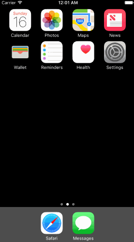

# Assignment Week 1 - *Dropbox project*

Time spent: **10** hours spent in total

## User Stories

User can tap through the 3 welcome screens.

User can follow the create user flow.

On the create user form, the user can tap the back button to go to the page where they can sign in or create an account.

Before creating the account, user can choose to read the terms of service.

After creating the account, user can view the placeholders for Files, Photos, and Favorites as well as the Settings screen.

User can log out from the Settings screen.

User can follow the sign in flow.

User can tap the area for "Having trouble signing in?"

User can log out from the Settings screen.

[Optional] Toggle a star to favorite a file

[Optional] Add a Text Field to trigger keyboard, and tap outside to dismiss it.

[Optional] Scrolling through the welcome screens instead of just tapping them.

## Video Walkthrough 

Here's a walkthrough of implemented user stories:

GIF created with [LiceCap](http://www.cockos.com/licecap/).

## Notes

I spent a long time to figure out how to trigger the transition manually.

Still working on adding page controllers to welcoming pages.
