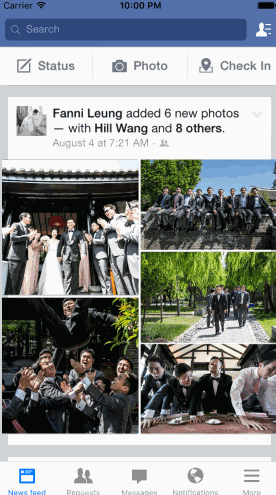

## Facebook

The purpose of this homework is to leverage animations and gestures to transition between screens. We're going to use the techniques from this week to implement some interactions in Facebook.

Time spent: **5** hours spent in total 

### Features

#### Required

- [x] Tapping on a photo in the news feed should expand the photo full screen.
- [x] Tapping the Done button should animate the photo back into its position in the news feed.
- [ ] On scroll of the full screen photo, the background should start to become transparent, revealing the feed.
- [ ] If the user scrolls a large amount and releases, the full screen photo should dismiss.

#### Optional

- [ ] The full screen photo should be zoomable.
- [ ] The user should be able to page through the other photos in full screen mode.

### Video Walkthrough 

Here's a walkthrough of implemented user stories:

